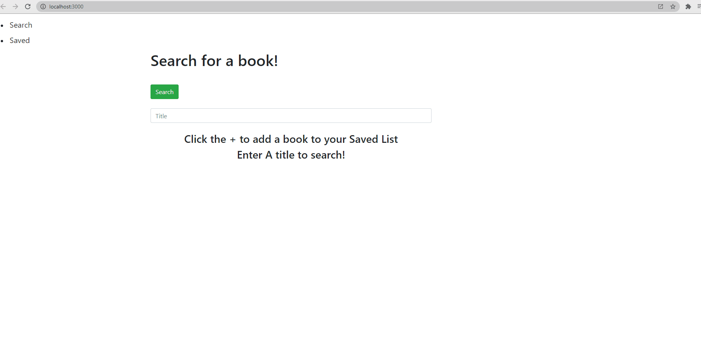

# Google-Book-Search-MERN
  This is a single page app that will let the user search for books with the googlebook api and save the ones they like to a list that can be pulled up and viewed later.
  

## To DO
  1. Fix post request so that books can actually be saved to the users list
  2. update CSS
  3. fix saved page not rerendering when a user deletes a book.
  4. fix page crash when returning unexpected results ( in this case a book not having a thumbnail)

## For the Grader(Temp section)
<ol>
  <li>The post request issue seems to be related to the format of the data that I'm trying to send, so maybe finding a better way to parse the data would fix that.</li>
  <li>The CSS just needs some more time and attention.</li>
  <li>The saved page issue might be fixed if I can add a way to trigger on button press, specifically when the user presses delete, re-render the page.</li>
  <li> I think I could do that by adding some logic that renders the  tag the way it is if the property exists or renders a stock image if it doesnt</li>
 </ol>

## Author

Cory M Scanlon

## Example Gif

# License

Copyright <2021> <Cory Scanlon>

Permission is hereby granted, free of charge, to any person obtaining a copy of this software and associated documentation files (the "Software"), to deal in the Software without restriction, including without limitation the rights to use, copy, modify, merge, publish, distribute, sublicense, and/or sell copies of the Software, and to permit persons to whom the Software is furnished to do so, subject to the following conditions:

The above copyright notice and this permission notice shall be included in all copies or substantial portions of the Software.

THE SOFTWARE IS PROVIDED "AS IS", WITHOUT WARRANTY OF ANY KIND, EXPRESS OR IMPLIED, INCLUDING BUT NOT LIMITED TO THE WARRANTIES OF MERCHANTABILITY, FITNESS FOR A PARTICULAR PURPOSE AND NONINFRINGEMENT. IN NO EVENT SHALL THE AUTHORS OR COPYRIGHT HOLDERS BE LIABLE FOR ANY CLAIM, DAMAGES OR OTHER LIABILITY, WHETHER IN AN ACTION OF CONTRACT, TORT OR OTHERWISE, ARISING FROM, OUT OF OR IN CONNECTION WITH THE SOFTWARE OR THE USE OR OTHER DEALINGS IN THE SOFTWARE.
